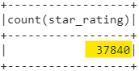

# Amazon_Vine_Analysis

## Overview of the Analysis
> The purpose of this project was to analyze Amazon reviews written by members of the paid Amazon Vine program. The Amazon Vine program is a service that allows manufacturers and publishers to receive reviews for their products. Companies like SellBy pay a small fee to Amazon and provide products to Amazon Vine members, who are then required to publish a review.

> In this project, I analyzed the category Pet Products for the Amazon database. I used PySpark to perform the ETL process to extract the dataset, transform the data, connect to an AWS RDS instance, and loaded the transformed data into pgAdmin. Next, I utilized PySpark to determine if there is any bias toward favorable reviews from Vine members in the dataset.

> My hypothesis is that the reviews from the Vine (paid) program will have higher ratings than those from the non-Vine (upaid) reviews. 

## Results
### Vine Results

* Analysis of the results for the Vine sub-set of reviews reveals:
  * n=170 reviews.
  * There were ***65*** **"5 star"** reviews.
  * Of all the reviews, ***38.24%*** were **"5 Star"**.

* Analysis of the results for the non-Vine sub-set of reviews reveals:
  * n=37840 reviews.
  * There were ***20,612*** **"5 star"** reviews.
  * Of all the reviews, ***54.47%*** were **"5 Star"**.
  
## Summary

My original hypothesis of bias towards a higher star rating from the Vine(paid) program doesn't seem to be correct based on the above results. If we look strictly at the 5 Star ratings, the non-Vine reviews seem to be significantly higher percentage wise than the Vine reviews. However, I do call into question that conclusion based on the number of ratings in each sub-group. The number of Vine reviews is significantly less than the number of non-vine reviews, 170 vs. 37840 respectively. These two groups may not be similar enough to draw a definitive conclusion. 

That would indicate to me that we should run a group of statistical tests on the two sub-sets to ensure they are similar enough to draw valid conclusions. The tests would include comparing their means and standard deviations as well as determining whether or not the two groups have a normal distribution of results. If they compare, then the results we see above may have more statistical validity. 
